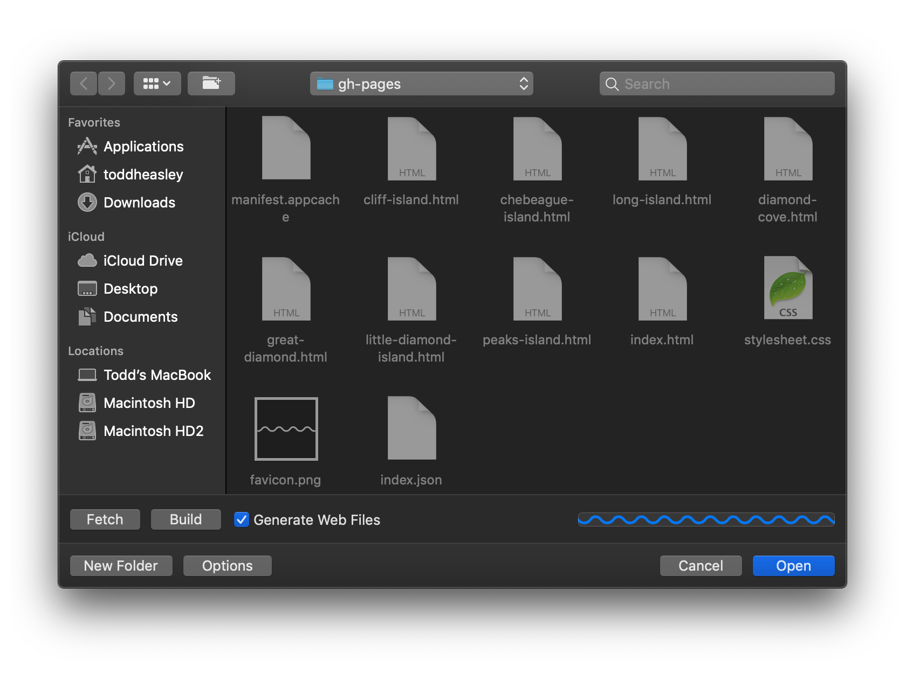

# BoatsEdit

BoatsEdit is a macOS utility that streamlines the process of updating Casco Bay Lines schedule data, including:

* Generating new schedules automatically by crawling [cascobaylines.com](https://cascobaylines.com)
* Fetching the current schedule remotely from GitHub
* Validating and previewing schedules

## Architecture

BoatsEdit is a glorified instance of `NSOpenPanel` that marshals the [`BoatsKit`](../BoatsKit) and [`BoatsWeb`](../BoatsWeb) frameworks.

Using `AppKit` is overkill for, effectively, two buttons that I plan to automate away. BoatsEdit is a stopgap and will be replaced by a `--web` flag for the [`boats`](../BoatsKit) command line interface, pending work to bake the external HTML templates, SVGs and CSS required by `BoatsWeb` into the compiled CLI executable; for now, bundling everything into a Mac app was less fiddly than linking frameworks and resources.

## Requirements

BoatsEdit is written in [Swift 5](https://docs.swift.org/swift-book) and requires [Xcode](https://developer.apple.com/xcode) 10.2 or newer to build.
