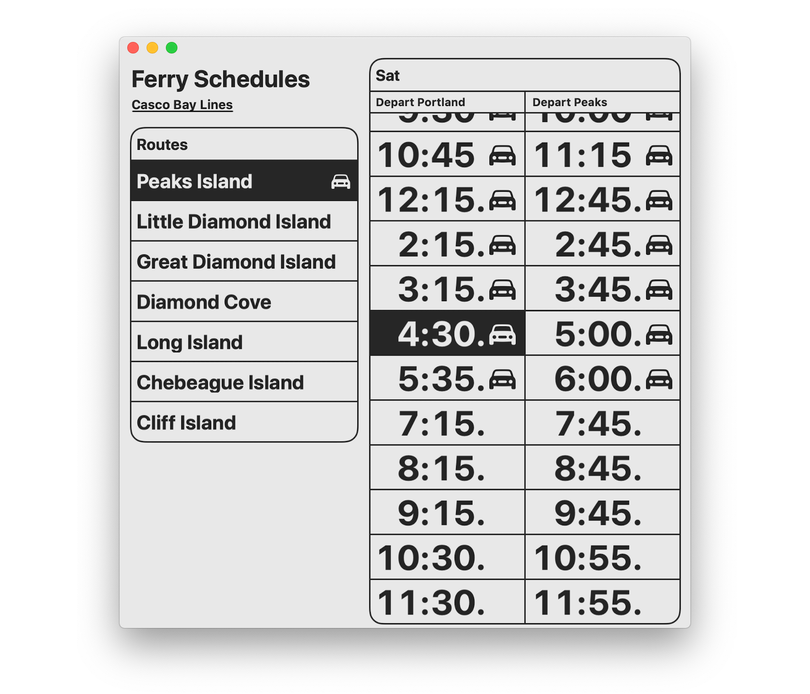

# Boats

Boats is an app for iPhone, iPad and Apple Watch that presents the complete [Casco Bay Lines](https://cascobaylines.com) ferry schedule for Peaks Island, Little Diamond Island, Great Diamond Island, Diamond Cove, Long Island, Chebeague Island and Cliff Island in a streamlined, glanceable format.

Boats 4 streamlines the high-contrast, large-type visual design from version 3 and includes a handful of major improvements:

* Seamless offline schedule viewing
* Complete coverage for holidays and other schedule deviations, such as departures that start or end mid-season
* System-level dark mode with a subtle, new appearance

## Boats for Mac

Via the "magic" of [Catalyst](https://developer.apple.com/mac-catalyst/)

## Web Schedules

Boats schedules are now also [__available on the web__](https://toddheasley.github.io/boats), with the same large type and mobile-friendly formatting.

## Architecture

The apps are made of thin layers of stock `UIKit` and `WatchKit`, backed by shared Swift packages that do all of the heavy lifting.

[`BoatsBot`](BoatsBot) handles data persistence and inter-extension communication -- and lays the groundwork for Boats to get a lot smarter in future releases with the addition of location-aware features or notifications.

Schedule data is provided by the [`BoatsKit`](BoatsKit) package, which is the foundation for the new modular backend. The recent [cascobaylines.com](https://cascobaylines.com) redesign made scraping possible, so `BoatsKit` also generates its own schedules.

`BoatsKit` is a huge step forward, but is not yet the self-updating, no-touch data source of my dreams. Currently, the process of generating schedule updates is implemented as a bundled macOS utility, [BoatsCLI.](Boats/BoatsCLI)

Web schedules are generated by [`BoatsWeb`.](BoatsWeb)

## Requirements

Targets [iOS](https://developer.apple.com/ios)/[iPadOS](https://developer.apple.com/ipad)/[tvOS ](https://developer.apple.com/tvos) 13, as well as [watchOS](https://developer.apple.com/watchos) 6 and [macOS](https://developer.apple.com/macos) 10.15 Catalina. Written in [Swift](https://developer.apple.com/documentation/swift) 5.1 using the [Foundation](https://developer.apple.com/documentation/foundation), [UIKit](https://developer.apple.com/documentation/uikit) and [WatchKit](https://developer.apple.com/documentation/watchkit) frameworks and requires [Xcode](https://developer.apple.com/xcode) 11 or newer to build.
