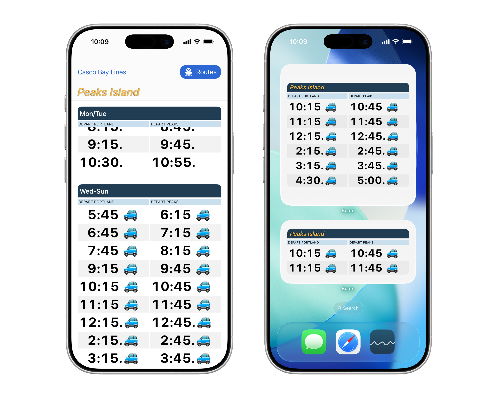
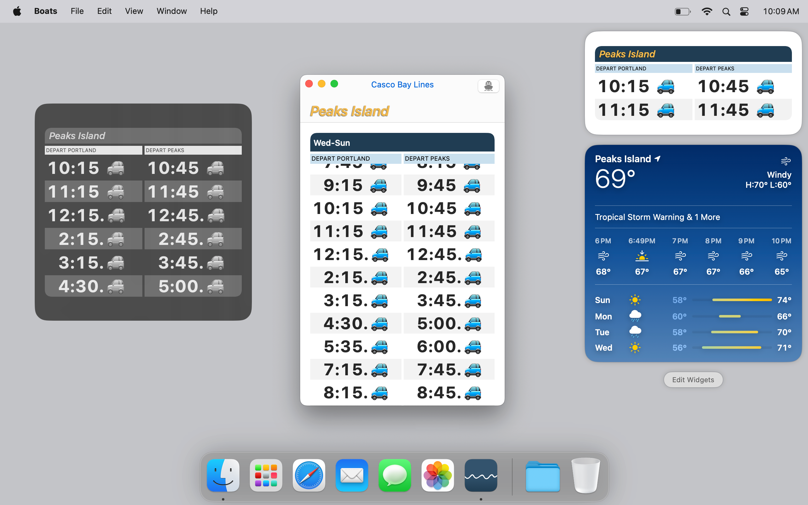

# Boats

__A friendly, Apple-native companion to [cascobaylines.com](https://cascobaylines.com)__

Boats packs the complete Casco Bay Lines ferry schedule for Peaks Island, Little Diamond Island, Great Diamond Island, Diamond Cove, Long Island, Chebeague Island and Cliff Island into every possible widget and complication across macOS, iOS and watchOS.

<picture>
  <source media="(prefers-color-scheme: dark)" srcset="docs/boats-app-dark.png">
  
</picture>

Boats 5 is a modern [SwiftUI](https://developer.apple.com/xcode/swiftui) app with an ultra-legible design. Widgets and complications keep the next ferry at a glance -- on iPhone, iPad, Apple Watch and Mac.

<picture>
  <source media="(prefers-color-scheme: dark)" srcset="docs/boats-mac-dark.png">
  
</picture>

## Web Schedules

<picture>
  <source media="(prefers-color-scheme: dark)" srcset="docs/boats-web-dark.png">
  
</picture>

Boats schedules are also [available on the web](https://toddheasley.github.io/boats), with the same large type and mobile-friendly format. 

## Total Package

Everything needed to build Boats is [bundled as a local Swift package](boats), including a scriptable command-line interface for scraping and validating new schedules.

<picture>
  <source media="(prefers-color-scheme: dark)" srcset="docs/boats-cli-dark.png">
  
</picture>

### Supported Platforms

Written in [Swift](https://developer.apple.com/documentation/swift) 6 for Apple stuff:

* [macOS](https://developer.apple.com/macos) 14 Sonoma
* [iOS](https://developer.apple.com/ios)/[iPadOS](https://developer.apple.com/ipad) 17
* [watchOS](https://developer.apple.com/watchos) 10

Build with [Xcode](https://developer.apple.com/xcode) 26 or newer. Command-line interface depends on [Swift Argument Parser.](https://github.com/apple/swift-argument-parser)
