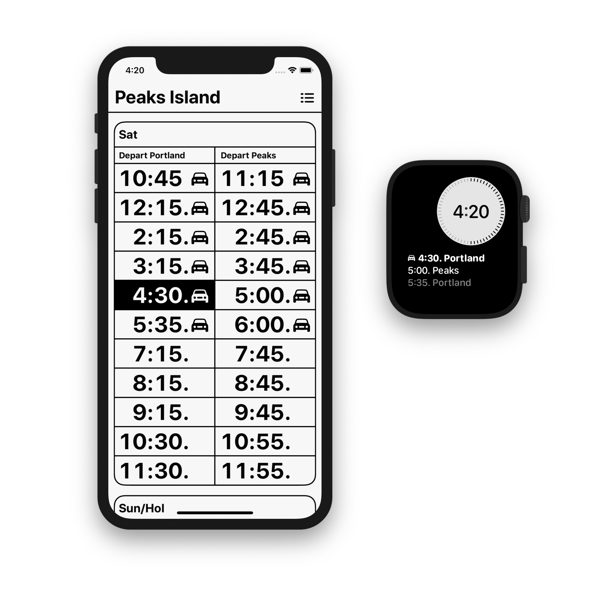

# Boats

Boats is an app for iPhone, iPad and Apple Watch that presents the complete [Casco Bay Lines](https://cascobaylines.com) ferry schedule for Peaks Island, Little Diamond Island, Great Diamond Island, Diamond Cove, Long Island, Chebeague Island and Cliff Island in a streamlined, glanceable format.

Boats 3 has a beautiful new design featuring:

* High contrast and large, bold type
* Complete coverage for holidays and other schedule deviations, such as departures that start or end mid-season
* User-settable light and dark modes, in addition to automatic mode that toggles based on screen brightness
* All new watch complications for Infograph, Infograph Modular, Utility and Modular faces
* Today View

## Web Schedules

Boats schedules are now also available on the web, with the same large type and mobile-friendly formatting:

[__cascobay.boats__](https://toddheasley.github.io/boats)

## Architecture

The iOS and watchOS apps are made of thin layers of stock `UIKit` and `WatchKit`, backed by shared frameworks that do all of the heavy lifting.

[`BoatsBot`](BoatsBot) handles data persistence and inter-app and inter-extension communication -- and lays the groundwork for Boats to get a lot smarter in future releases with the addition of location-aware features or notifications.

Schedule data is provided by the [`BoatsKit`](BoatsKit) framework, which is the foundation for the new modular backend. The recent [cascobaylines.com](https://cascobaylines.com) redesign made scraping possible, so `BoatsKit` also generates its own schedules.

`BoatsKit` is a huge step forward, but is not yet the self-updating, no-touch data source of my dreams. Currently, the process of generating schedule updates is implemented as a bundled macOS utility, [BoatsEdit.](BoatsEdit)

Web schedules are generated by the [`BoatsWeb`](BoatsWeb) framework.

## Requirements

Boats is written in [Swift 5](https://docs.swift.org/swift-book) and requires [Xcode](https://developer.apple.com/xcode) 10.2 or newer to build.
