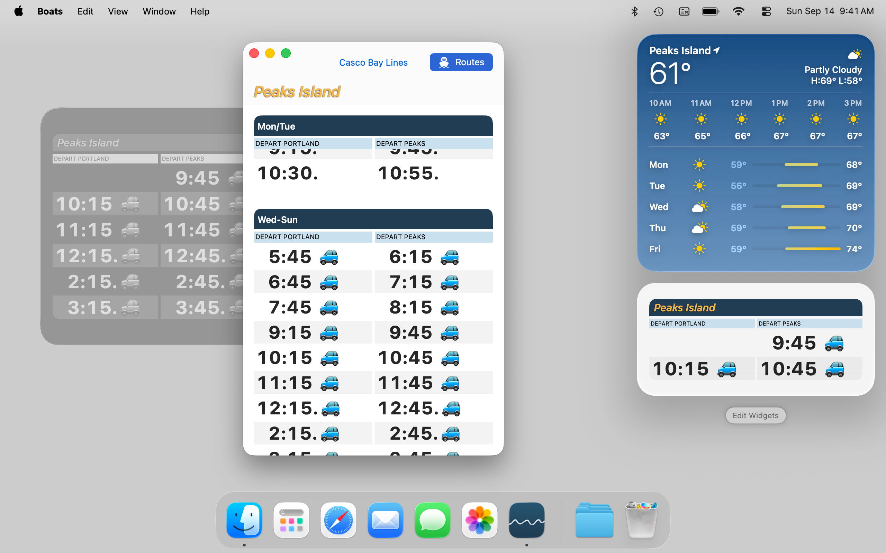

# Boats

Boats is a friendly, Apple-native companion to [cascobaylines.com.](https://cascobaylines.com) It packs the complete Casco Bay Lines ferry schedule for Peaks Island, Little Diamond Island, Great Diamond Island, Diamond Cove, Long Island, Chebeague Island and Cliff Island into every possible widget and complication across macOS, iOS and watchOS.

Boats 5 is a completely new [SwiftUI](https://developer.apple.com/xcode/swiftui) app with an ultra-legible new design that merges CBL's quirky look and feel with the same big, bold type and fancy scrolling from previous versions. Boats even returns to the Mac as a true Cocoa app, including support for Sonoma desktop widgets:

### Supported Platforms

Written in [Swift](https://developer.apple.com/documentation/swift) 5.9 for Apple stuff:

* [macOS](https://developer.apple.com/macos) 14 Sonoma
* [iOS](https://developer.apple.com/ios)/[iPadOS](https://developer.apple.com/ipad) 17
* [watchOS](https://developer.apple.com/watchos) 10

Build with [Xcode](https://developer.apple.com/xcode) 15 or newer. Command-line interface depends on [Swift Argument Parser.](https://github.com/apple/swift-argument-parser)

Keep the next few ferries at a glance.

There's no onboarding, no account signup, no ads and no tracking. The only configuration is picking which island a widget should display. Worth the free download, whether you're a year-round commuter or just visiting for a few hours.

* Seamless offline schedule viewing
* Complete coverage for holidays and other schedule deviations, such as departures that start or end mid-season 
