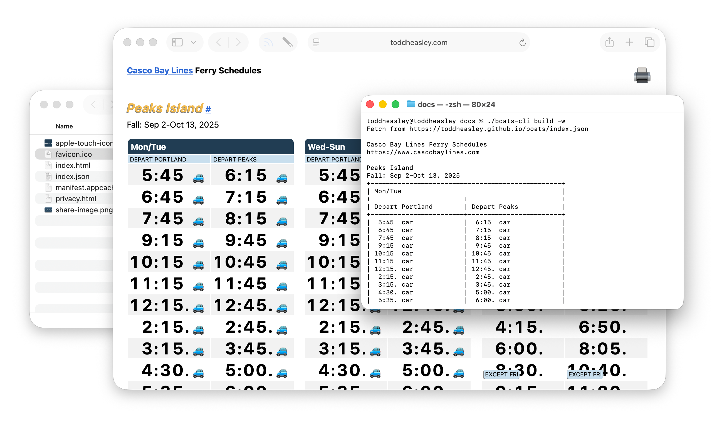
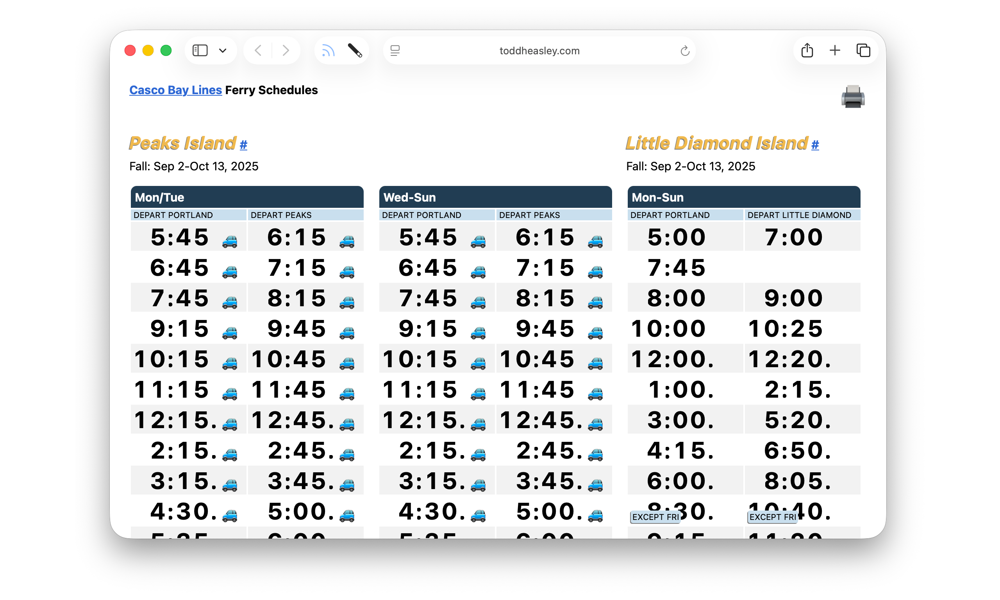

# `Boats` Package

Libraries that build and drive the Boats app

### Supported Platforms

Written in [Swift](https://developer.apple.com/documentation/swift) 5.9 for Apple stuff:

* [macOS](https://developer.apple.com/macos) 14 Sonoma
* [iOS](https://developer.apple.com/ios)/[iPadOS](https://developer.apple.com/ipad)/[tvOS](https://developer.apple.com/tvos) 17
* [watchOS](https://developer.apple.com/watchos) 10
* [visionOS](https://developer.apple.com/visionos)

Build with [Xcode](https://developer.apple.com/xcode) 15 or newer. Command-line interface depends on [Swift Argument Parser.](https://github.com/apple/swift-argument-parser)

## `BoatsCLI`

Fetch, build and debug Boats schedules and web pages using a scriptable command-line interface.



### Example Usage

Archive `boats-cli` target and move executable into the desired build directory. From any shell, `fetch` schedule data as a [static JSON file](https://toddheasley.github.io/boats/index.json) hosted by GitHub:

```zsh
./boats-cli fetch
```

Scrape new schedule data from [cascobaylines.com](https://www.cascobaylines.com) directly:

```zsh
./boats-cli build
```

Rebuild existing local schedule data and generate static web pages:

```zsh
./boats-cli debug -w
```

## `BoatsWeb`



`BoatsWeb` extends the functionality of `Boats`:

* Generate static web pages from schedule data

### Example Usage

```swift
import Boats
import BoatsWeb

let index = try Index(from: FileManager.default.temporaryDirectory)
try Site(index).build(to: FileManager.default.temporaryDirectory)
```

## `Boats`

`Boats` provides the complete Casco Bay Lines ferry schedule as a modeled interface:

* Generate schedules automatically by crawling [cascobaylines.com](https://www.cascobaylines.com)
* Fetch the current schedule remotely from GitHub
* Query timetables and departures using `Date`
* Cache schedules for offline use

### Example Usage

```swift
import Boats

let index = try await URLSession.shared.index(.build)
try index.build(to: FileManager.default.temporaryDirectory)
```
